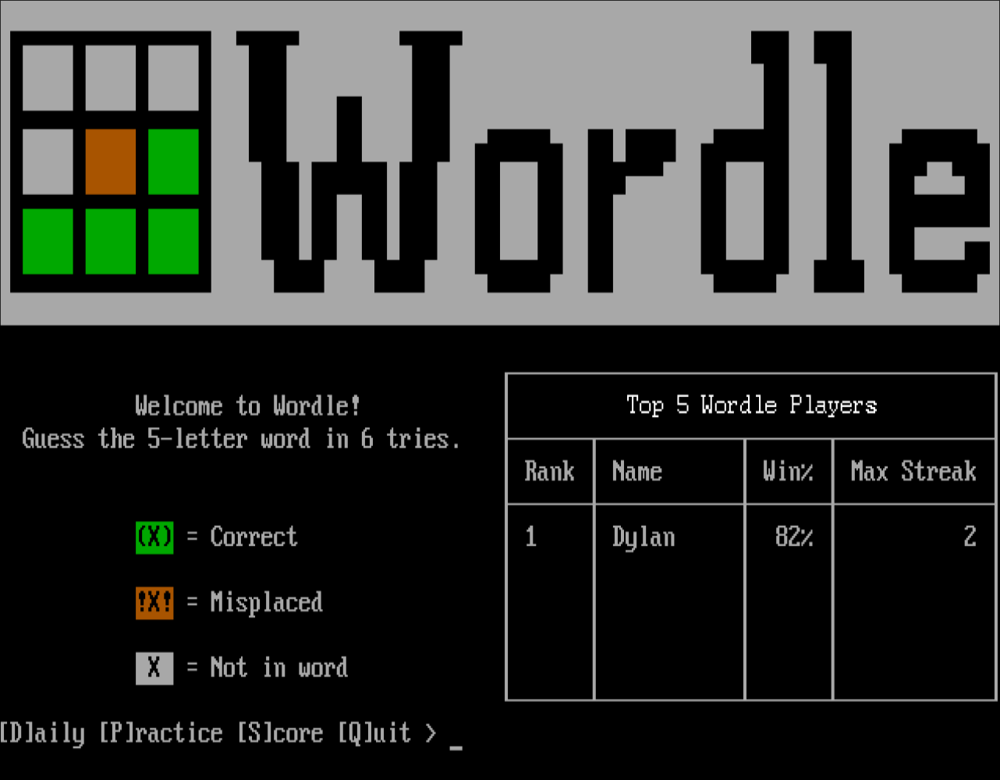
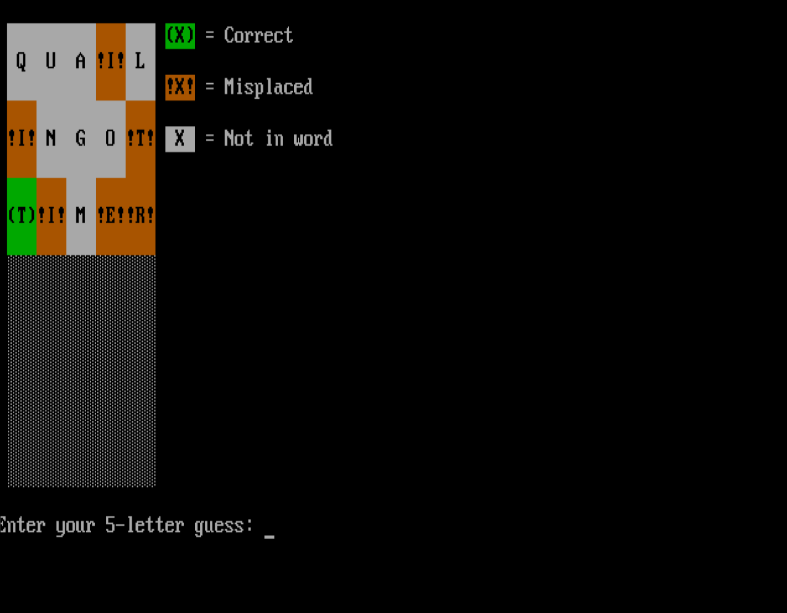
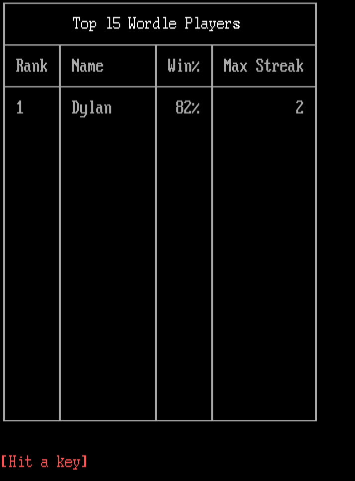
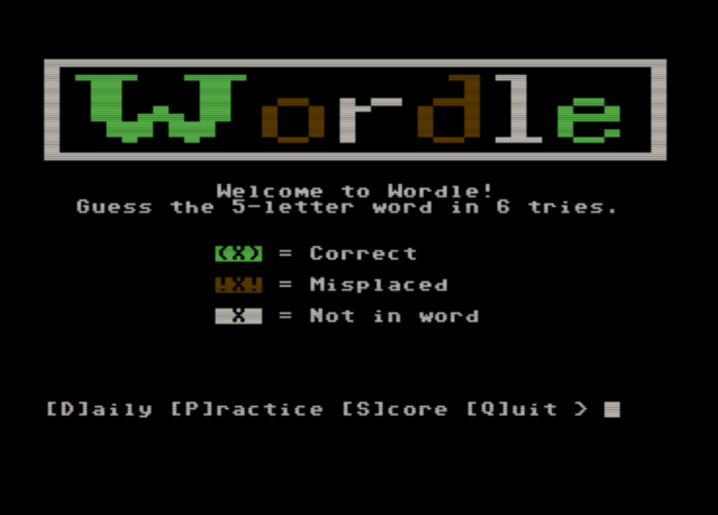
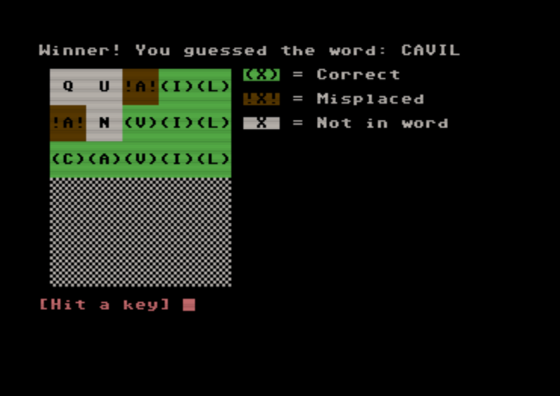
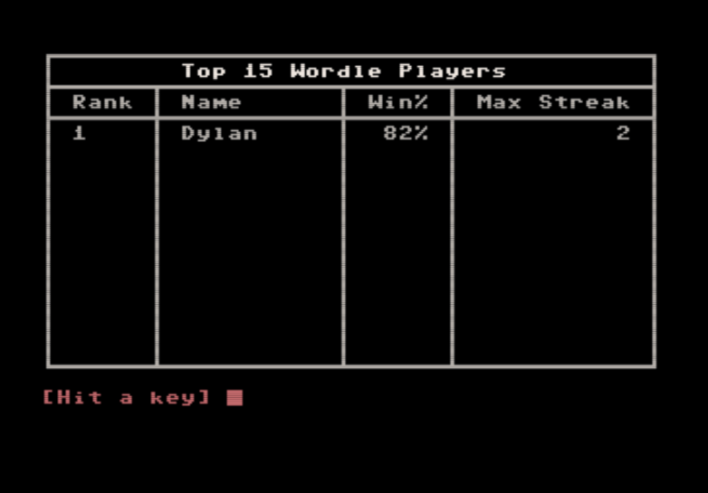

# Synchronet Wordle
This is a wordle clone built for use on Synchronet BBSes. Mostly to learn more about how synchronet handles doors under the hood.
I also wanted a simple game to learn on, and wordle seemed like a perfect fit. 

# AI Usage
- I used Claude in an assistive capacity to help me understand the older syntax of JS that synchronet uses, and to debug. The ideas for how the game works are mine, the implementation of those elements has a mixed usage of AI and human coding.
- I also used self-hosted gemma4:e4b to write documentation and cleanup this readme. I wanted to see what I could offload from cloud usage and save on tokens for tedious tasks.
    - It did a pretty good job, for the most part. And the best part of it, gemma:e4b is small enough to be run on a laptop (depending on the laptop).

# Features
- Core Wordle gameplay
- Daily challenges where all players play the same word once per day
- Practice mode with a randomly selected word
- Player statistics tracking (wins, losses, win percentage, current streak, max streak)
- Scoreboard viewable from the main menu, showing the top players by win percentage
- 40-column and 80-column terminal support
- ASCII terminal support (plain-text banners served to dumb terminals)

# Screenshots
### 80 Column Mode in Color (Syncterm)

### 40 Column Mode in Color (CCGMS on C64U)

# How to Play
Guess the 5-letter word in 6 tries. After each guess, each letter is marked as one of the following (with color also, if supported by the client terminal):
- `(X)` — Correct letter in the correct position
- `!X!` — Correct letter in the wrong position
-  `X`  — Letter is not in the word
Guesses must be real words. The game will reject guesses that are not in the valid word dictionary.

### Menu Options
- **D** — Play today's daily challenge (one per day, per user)
- **P** — Play a practice game with a random word (unlimited)
- **S** — View the full scoreboard
- **Q** — Quit

# Requirements
- Synchronet BBS v3.14 or later

# Sysop Documentation
### Installation
- CD to the `xtrn` folder in your synchronet files.
- Clone this repo into your Synchronet xtrn directory using `git clone https://github.com/bigdale123/synchro-wordle.git wordle`.
- Install Synchro-Wordle using the provided `install-xtrn.ini` with `exec/jsexec install-xtrn.js ../xtrn/wordle`.

### Notes
- Player statistics are stored as JSON in your Synchronet data directory (wordle_stats.json). This file is created automatically on first play and does not need to be created manually.
- It should be possible to change the valid dictionary and the word bank by editing `valid-words.csv` and `word-bank.csv`, respectively.
    - `valid-words.csv` is the larger CSV, and is used to make sure that a player's guess is actually a word and not just 5 characters repeated.
    - `word-bank.csv` is the smaller csv, and is used to pull the words you guess from.
    - If you do decide to make edits to the CSV, make sure that you either enter words that are `WORD_LENGTH` characters long, or update `WORD_LENGTH` in `wordle.js` to reflect the change.

# Word Lists
The word bank and valid word dictionary come from [wordle-words by seanpatlan](https://github.com/seanpatlan/wordle-words/blob/main/word-bank.csv). Credit to the original author.